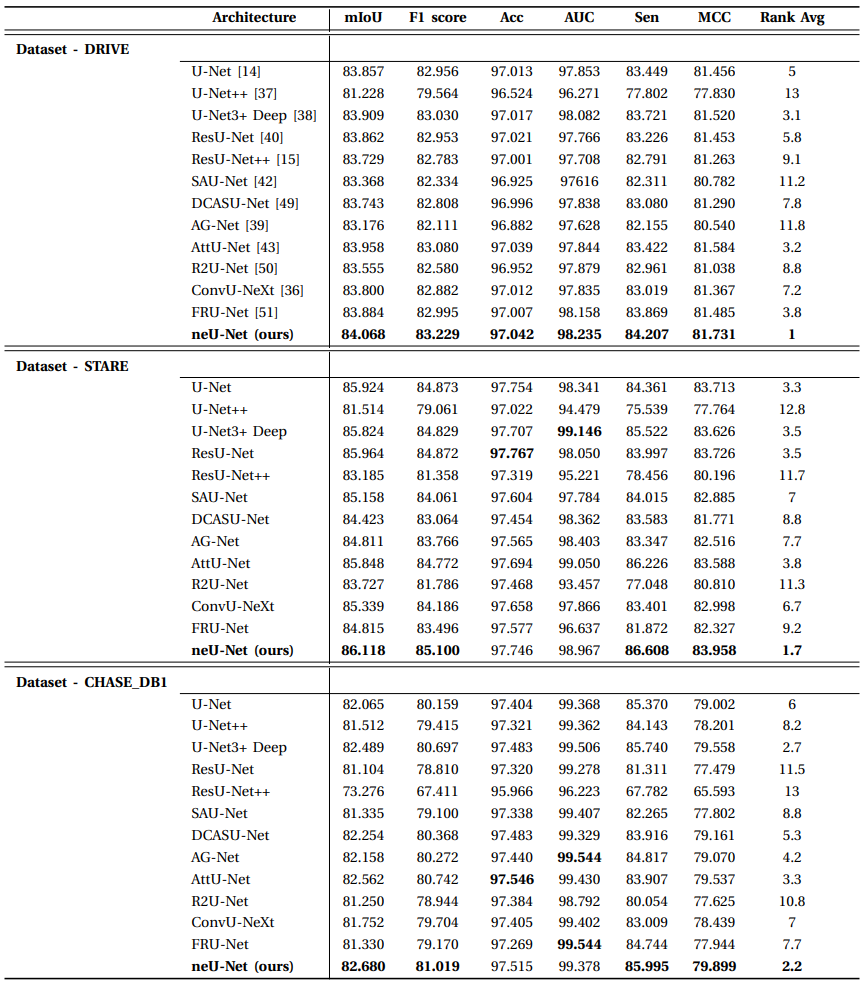

# [Official] [neU-Net: Renewing U-Net Design in Retinal Vessel Segmentation]


## Environment

- OS: Ubuntu 16.04
- GPU: Tesla V100 32GB
- GPU Driver version: 460.106.00
- CUDA: 11.2
- Pytorch 1.8.1

## Experimental Result



## Pretrained model for each dataset
[neU-Net for DRIVE](https://mega.nz/file/Ao0y2CIS#AlAqBogW8oAL4aAO9JLLW4cLi64lWx_8qmGxqqMoRPY) <br>
[neU-Net for STARE](https://mega.nz/file/A9FWHTBS#Mv2A_8SGHVi9XABww3HcAnPMt027BrDv-Ko9hmhTsHQ) <br>
[neU-Net for CHASE_DB1](https://mega.nz/file/xg9WyYCS#Scd5JlkXbPBOo-OFtA1P74zqEaq2qb1brPz6xFq4yfI) <br>


## Dataset Preparation
You can edit <b>'train_x_path...'</b> in "<b>configs/train.yml"</b> <br>
The input and label should be sorted by name, or the dataset is unmatched to learn.

For train/validation set, you can download from public link or divided dataset below. <br>
[Train/Validation set for DRIVE](https://mega.nz/file/dwNCXRpK#5cO-XaL_mW2kyknajrB9QEdqswz6DTS-pkODcfaO1OU) <br>
[Train/Validation set for STARE](https://mega.nz/file/B8NQRYqL#2r-rI4-Y4JOhA62KYPDR5sedyNXFRiMCeQBWYi8ejdA) <br>
[Train/Validation set for CHASE_DB1](https://mega.nz/file/IosDGJjJ#vH7HKRZEkgh1Yt8iOQoyuzFc-PqfJQHzx1Sn7wU2QAY) <br>

<details>
<summary>Train</summary>

If you have installed 'WandB', login your ID in command line.<br>
If not, fix <b>'wandb: false'</b> in <b>"configs/train.yml"</b>
You can login through your command line or <b>'wandb.login()'</b> inside <b>"main.py"</b> 

For <b>Train</b>, edit the [<b>configs/train.yml</b>](configs/train.yml) and execute below command
```
bash bash_train.sh
```
</details>


<details>
<summary>Inference</summary>

For <b>Inference</b>, edit the [<b>configs/inference.yml</b>](configs/inference.yml) and execute below command. <br>
Please locate your model path via  <b>'model_path'</b> in <b>"configs/inference.yml"</b>
```
bash bash_inference.sh
```

</details>

